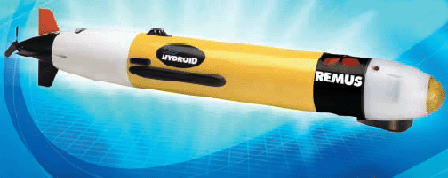

# Matlab implementation of the semi empirical calculation for a REMUS 100

This file implements the equation presented in [Prestero](https://core.ac.uk/download/pdf/4429735.pdf).

Please notice that there is different version of the vehicle.

  
 

## Getting Started

Please download first https://www.mathworks.com/matlabcentral/fileexchange/62113-slice_stl_create_path-triangles-slice_height

Run the script AddedMassCalcualtorRemus.m

Check the variables created

## Referencing

If you wish to reference this code please cite:

W. Ariza Ramirez, Gaussian Processes applied to system identification, navigation and control of underwater vehicles, PhD Thesis, Australian Maritime College 2019

https://eprints.utas.edu.au/32574/

If you find an error please let me know

## Author

Wilmer Ariza Ramirez

Australian Maritime College, 
University of Tasmania, Newnham TAS 7248, Australia

Wilmer.ArizaRamirez@utas.edu.au 
